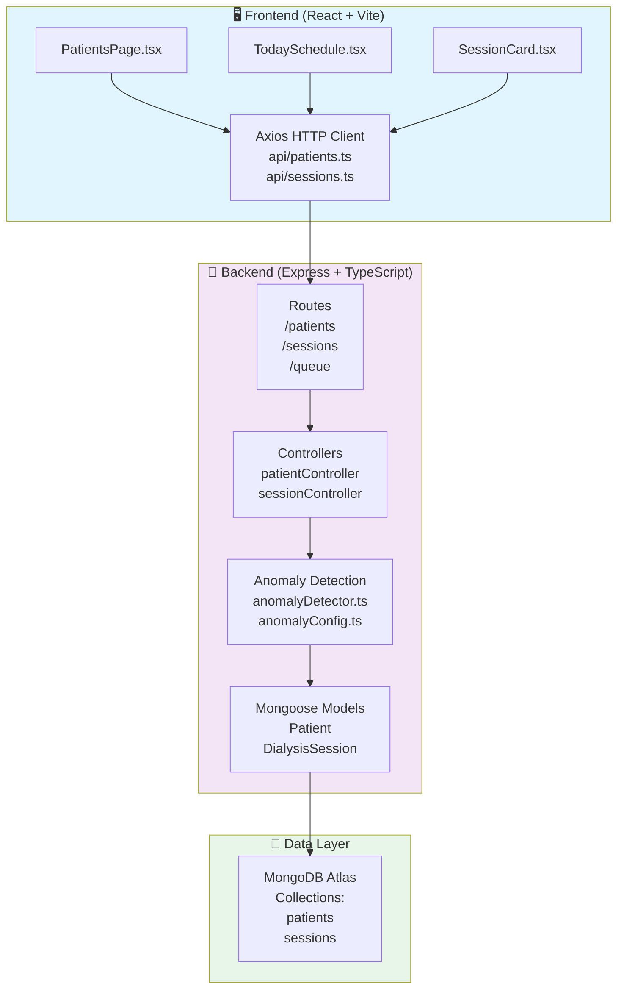
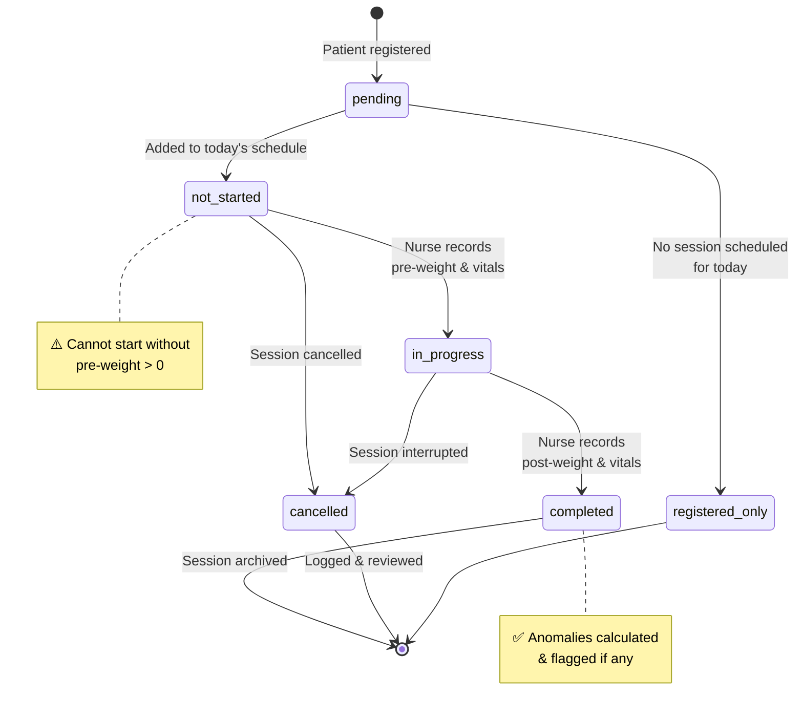
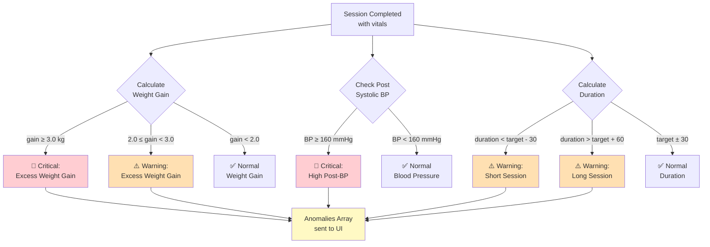
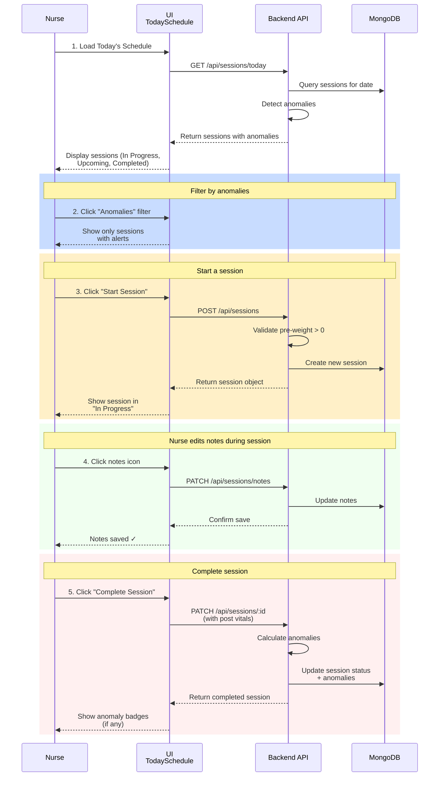
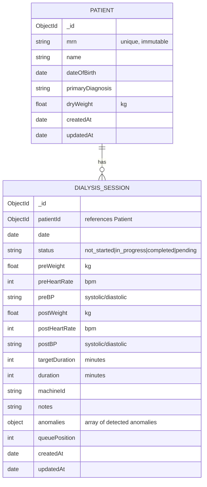
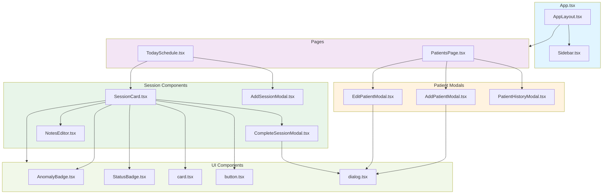

# Dialysis Dashboard — Session Intake & Anomaly Detection

A full-stack clinical dashboard for managing dialysis sessions, patient intake, and automated anomaly detection. Designed to streamline nursing workflows, capture critical patient vitals, and surface potentially unsafe clinical situations such as excessive weight gain and elevated post-dialysis blood pressure.

**Stack**: TypeScript + Express + React (Vite) + MongoDB

---

## Quick Start

**Prerequisites**: Node 18+, MongoDB Atlas URI (or local MongoDB)

```bash
# 1. Clone & install dependencies
git clone <repository-url>
cd dialysis-dashboard

# 2. Backend setup
cd backend
npm install
cp .env.example .env
# Edit .env and set MONGO_URI to your MongoDB connection string

# 3. Seed the database with example patients & sessions
npm run seed

# 4. Start backend dev server (runs on http://localhost:5000)
npm run dev

# 5. In a new terminal, start frontend
cd ../frontend
npm install
npm run dev
# Frontend runs on http://localhost:5173
```

### Available Scripts

**Backend:**
```bash
npm run build      # TypeScript compilation
npm run dev        # Start Express server with nodemon (auto-reload)
npm run seed       # Populate MongoDB with 6 test patients and varied session scenarios
npm test           # Run Jest unit tests (anomaly detection, API routes)
```

**Frontend:**
```bash
npm run dev        # Start Vite dev server
npm run build      # Build for production (dist/)
npm test           # Run Vitest unit tests (components, hooks)
npm run lint       # ESLint + TypeScript checks
```

## Architecture

### System Architecture Diagram



**Request Flow**: React component → Axios HTTP client → Express route → Controller → Anomaly detector → Mongoose model → MongoDB. Anomalies computed server-side, included in API response.

---

### Session Lifecycle State Diagram



---

### Anomaly Detection Logic



---

## API Documentation

### Base URL
```
http://localhost:5000
```

### Endpoints

#### **Patients**

**GET /api/patients**
- Fetch all patients with their latest session data
- Query params: `?filter=name|mrn|diagnosis|high_risk`
- Response includes:
  ```json
  {
    "_id": "...",
    "mrn": "1001",
    "name": "Ananya Patel",
    "dateOfBirth": "1965-03-20",
    "primaryDiagnosis": "Chronic Kidney Disease Stage 5",
    "dryWeight": 58.0,
    "latestSession": {
      "sessionId": "...",
      "date": "2026-03-21",
      "preWeight": 60.2,
      "postWeight": 57.5,
      "preBP": "138/82",
      "postBP": "156/88",
      "duration": 180,
      "isCompleted": true,
      "anomalies": [
        { "type": "high_post_bp", "severity": "critical" }
      ]
    },
    "allAnomalies": [ /* array of all anomaly types */ ]
  }
  ```

**POST /api/patients**
- Register a new patient
- Body:
  ```json
  {
    "mrn": "1007",
    "name": "Jane Doe",
    "dateOfBirth": "1970-05-15",
    "primaryDiagnosis": "ESRD on HD",
    "dryWeight": 65.0
  }
  ```

**PUT /api/patients/:id**
- Update patient demographics or dry weight
- Body: Any of the above fields (except mrn, which is immutable)

---

#### **Sessions**

**GET /api/sessions/today**
- Fetch today's scheduled sessions for all patients, grouped by status
- Response:
  ```json
  {
    "inProgress": [ /* SessionCard data */ ],
    "upcoming": [ /* SessionCard data */ ],
    "completed": [ /* SessionCard data */ ],
    "summary": {
      "inProgress": 1,
      "upcoming": 3,
      "completed": 2,
      "anomalies": 4
    }
  }
  ```

**POST /api/sessions**
- Create a new session for a patient
- Body:
  ```json
  {
    "patientId": "...",
    "preWeight": 60.2,
    "preHeartRate": 72,
    "targetDuration": 180,
    "machineId": "M-01"
  }
  ```

**PATCH /api/sessions/:id**
- Update an in-progress session (add post vitals, complete the session)
- Body:
  ```json
  {
    "postWeight": 57.5,
    "postBP": "156/88",
    "postHeartRate": 75,
    "duration": 185,
    "notes": "Patient tolerated well",
    "isCompleted": true
  }
  ```

**PATCH /api/sessions/:id/notes**
- Update session notes (live edit during session)
- Body:
  ```json
  {
    "notes": "Patient feeling better after fluid removal"
  }
  ```

---

#### **Queue Management**

**PATCH /api/queue/reorder**
- Reorder the session queue (drag-and-drop support)
- Body:
  ```json
  {
    "reorderedIds": ["sessionId1", "sessionId2", "sessionId3"]
  }
  ```

---

### Status Codes
- `200 OK` — Successful request
- `201 Created` — Resource created successfully
- `400 Bad Request` — Validation error (e.g., missing preWeight, duplicate MRN)
- `404 Not Found` — Patient/session not found
- `500 Internal Server Error` — Server-side issue

---

## Nurse Workflow



---

## Clinical Assumptions & Trade-offs

All thresholds and rules are **configurable** in [`backend/src/config/anomalyConfig.ts`](backend/src/config/anomalyConfig.ts). No magic numbers are scattered in business logic.

### Weight Gain (Interdialytic)
| Category | Threshold | Severity | Rationale |
|----------|-----------|----------|-----------|
| Excess weight gain | ≥ 2.0 kg | ⚠️ Warning | Standard ESRD guideline; typical target is 3–5% of dry weight between sessions |
| Critical weight gain | ≥ 3.0 kg | 🔴 Critical | 1.5× the warning threshold; signals high risk of pulmonary edema or cardiovascular stress |

**Logic**: `weight_gain = pre_weight − dry_weight`. Calculated automatically when a session starts.

---

### Blood Pressure (Post-Dialysis)
| Category | Threshold | Severity | Rationale |
|----------|-----------|----------|-----------|
| High post-dialysis systolic BP | ≥ 160 mmHg | 🔴 Critical | Conservative threshold to flag potential hypertensive episodes post-treatment |

**Assumption**: Post-dialysis BP ≥160 indicates inadequate fluid removal or rebound hypertension. Threshold is adjustable per patient cohort.

---

### Session Duration
| Category | Threshold | Severity | Rationale |
|----------|-----------|----------|-----------|
| Short session | > 30 min below target | ⚠️ Warning | May indicate inadequate solute clearance |
| Long session | > 60 min above target | ⚠️ Warning | May cause dialysis-related symptoms or patient fatigue |

**Example**: If target duration is 180 min, then <150 min is short, >240 min is long.

---

### Additional Trade-offs

**MRN Immutability**
- Once a patient is registered, their MRN cannot be changed.
- **Reason**: Ensures record integrity and prevents duplicate medical histories.

**Queue Management**
- Default: FIFO (first-in, first-out) by registration order.
- Nurses can manually reorder via drag-and-drop for clinical priority.
- **Reason**: Balances automation with clinical flexibility.

**Pre-Session Weight Requirement**
- A session **cannot start** without recording pre-weight.
- **Reason**: Weight gain is the most critical real-time anomaly detector.

**Anomaly Scoring**
- Anomalies are **independent**; one session can have multiple anomalies.
- Example: A patient might have excess weight gain *and* high post-BP.
- **Reason**: Real-world scenarios often involve multiple risk factors.

---

## Tests

The project includes comprehensive unit and component tests. Run all tests:

```bash
# Backend tests
cd backend
npm test

# Frontend tests
cd ../frontend
npm test
```

### Backend Tests (Jest)

**Location**: `backend/src/__tests__/`

1. **Anomaly Detection Logic** (`anomalyDetector.test.ts`)
   - Tests pure `detectAnomalies()` function with various vitals combinations
   - Examples:
     - ✅ No anomalies when all vitals normal
     - ✅ Detects `high_post_bp` when postBP ≥ 160 mmHg
     - ✅ Detects `excess_weight_gain` when gain ≥ 2.0 kg
     - ✅ Detects `short_session` when duration < target − 30 min

2. **Session Route** (`routes/__tests__/sessions.test.ts`)
   - Tests `/api/sessions` POST and PATCH endpoints
   - Examples:
     - ✅ Cannot start session without preWeight
     - ✅ Returns 400 if preWeight is 0 or negative
     - ✅ Correctly calculates anomalies on session completion
     - ✅ Returns structured response with anomaly array

**Coverage**: 10/10 tests passing (business logic + API contract)

---

### Frontend Tests (Vitest)

**Location**: `frontend/src/components/session/__tests__/`

1. **SessionCard Component** (`SessionCard.test.tsx`)
   - Tests rendering of session card with various states
   - Examples:
     - ✅ Displays "In Progress" badge for active sessions
     - ✅ Shows pre-vitals for not-started sessions
     - ✅ Highlights anomalies with color-coded badges
     - ✅ Renders machine ID on completed sessions

2. **AnomalyBadge Component** (implicit via SessionCard tests)
   - Verifies anomaly badges render with correct severity color

**Coverage**: 3/3 tests passing (component rendering + props validation)

---

## Data Model

### Entity Relationship Diagram



---

### Patient Schema (MongoDB)
```typescript
{
  _id: ObjectId,
  mrn: String (unique, immutable),
  name: String,
  dateOfBirth: Date,
  primaryDiagnosis: String,
  dryWeight: Number (kg),
  createdAt: Date,
  updatedAt: Date
}
```

### DialysisSession Schema (MongoDB)
```typescript
{
  _id: ObjectId,
  patientId: ObjectId (ref: Patient),
  date: Date,
  status: "not_started" | "in_progress" | "completed" | "pending",
  
  // Pre-session vitals (recorded when session starts)
  preWeight: Number (kg),
  preHeartRate: Number (bpm),
  preBP: String ("systolic/diastolic"),
  
  // Post-session vitals (recorded when session ends)
  postWeight: Number (kg),
  postHeartRate: Number (bpm),
  postBP: String ("systolic/diastolic"),
  
  // Session metadata
  targetDuration: Number (minutes),
  duration: Number (minutes, set when completed),
  machineId: String,
  notes: String,
  
  // Computed
  anomalies: Array<{
    type: "excess_weight_gain" | "high_post_bp" | "short_session" | "long_session",
    severity: "warning" | "critical"
  }>,
  
  queuePosition: Number,
  createdAt: Date,
  updatedAt: Date
}
```

---

## Example Scenarios (Seed Data)

The seed script populates 6 patients with varied session scenarios:

1. **Ananya Patel** (MRN: 1001)
   - In-progress session with high post-BP (156 mmHg) and short-duration anomaly
   - Demonstrates multi-anomaly flagging

2. **Michael Reyes** (MRN: 1002)
   - Completed session with all normal vitals, no anomalies

3. **Farah Khan** (MRN: 1003)
   - Not-started session with pre-vitals entered (59.2 kg, 134/84)
   - Shows pre-session weight for comparison

4. **Leo Martins** (MRN: 1004)
   - In-progress normal session (no anomalies yet)

5. **Nora Ibrahim** (MRN: 1005)
   - Completed session with long-duration warning anomaly

6. **Omar Haddad** (MRN: 1006)
   - Registered but no session scheduled today
   - Demonstrates patient without active session

Run `npm run seed` in the backend to populate the database.

---

## Frontend Component Hierarchy



---

## Project Structure

```
dialysis-dashboard/
├── backend/
│   ├── src/
│   │   ├── config/
│   │   │   ├── db.ts              # MongoDB connection
│   │   │   └── anomalyConfig.ts   # Threshold configuration
│   │   ├── controllers/
│   │   │   ├── patientController.ts
│   │   │   └── sessionController.ts
│   │   ├── models/
│   │   │   ├── Patient.ts
│   │   │   └── Session.ts
│   │   ├── routes/
│   │   │   ├── patientRoutes.ts
│   │   │   ├── sessionRoutes.ts
│   │   │   └── __tests__/
│   │   │       └── sessions.test.ts
│   │   ├── utils/
│   │   │   ├── anomalyDetector.ts
│   │   │   └── __tests__/
│   │   │       └── anomalyDetector.test.ts
│   │   ├── middleware/
│   │   │   ├── validate.ts
│   │   │   └── errorHandler.ts
│   │   ├── scripts/
│   │   │   └── seed.ts
│   │   └── index.ts               # Express app entry
│   ├── package.json
│   └── tsconfig.json
│
├── frontend/
│   ├── src/
│   │   ├── components/
│   │   │   ├── layout/
│   │   │   │   ├── AppLayout.tsx
│   │   │   │   └── Sidebar.tsx
│   │   │   ├── patient/
│   │   │   │   ├── AddPatientModal.tsx
│   │   │   │   ├── EditPatientModal.tsx
│   │   │   │   └── PatientHistoryModal.tsx
│   │   │   ├── session/
│   │   │   │   ├── SessionCard.tsx
│   │   │   │   ├── AddSessionModal.tsx
│   │   │   │   ├── CompleteSessionModal.tsx
│   │   │   │   ├── NotesEditor.tsx
│   │   │   │   └── __tests__/
│   │   │   │       └── SessionCard.test.tsx
│   │   │   └── ui/
│   │   │       ├── AnomalyBadge.tsx
│   │   │       ├── StatusBadge.tsx
│   │   │       └── ... (shadcn components)
│   │   ├── pages/
│   │   │   ├── PatientsPage.tsx
│   │   │   └── TodaySchedule.tsx
│   │   ├── api/
│   │   │   ├── client.ts          # Axios HTTP client
│   │   │   ├── patients.ts
│   │   │   └── sessions.ts
│   │   ├── types/
│   │   │   └── index.ts
│   │   ├── context/
│   │   │   └── ThemeContext.tsx
│   │   ├── App.tsx
│   │   └── main.tsx
│   ├── package.json
│   └── vite.config.ts
│
└── README.md
```

---

## Resources & Documentation

- **MongoDB Documentation**: [docs.mongodb.com](https://docs.mongodb.com)
- **Express.js Guide**: [expressjs.com](https://expressjs.com)
- **React Hooks**: [react.dev](https://react.dev)
- **Tailwind CSS**: [tailwindcss.com](https://tailwindcss.com)

---

## Development Workflow

1. **Feature branches**: Create a feature branch off `main`
   ```bash
   git checkout -b feat/add-patient-notes
   ```

2. **Testing**: Run tests locally before pushing
   ```bash
   npm test (in backend & frontend directories)
   ```

3. **Commits**: Atomic, descriptive commits
   ```bash
   git commit -m "feat: add patient history modal with session export"
   ```

4. **Pull Requests**: Push to GitHub and create a PR with a clear description

---
## Future Enhancements

- **Authentication & Authorization**: Role-based access control (nurse, doctor, admin)
- **Real-time Updates**: WebSocket integration for live session status across devices
- **ML-based Anomaly Detection**: Personalized baselines per patient instead of global thresholds
- **Machine Pool Management**: Auto-assign patients from queue when machines become available
- **Audit Logging**: Record all data changes for HIPAA compliance
- **Multi-site Support**: Timezone handling and per-unit configuration
- **Export Reports**: PDF/CSV export for session summaries and patient history
- **Mobile App**: Native iOS/Android for point-of-care documentation

---

## Support & Troubleshooting

**Issue**: "MONGO_URI is not defined"
- Ensure `.env` file exists in `backend/` with a valid MongoDB connection string.

**Issue**: "Cannot POST /api/sessions"
- Check that the backend server is running (`npm run dev` from `backend/`)

**Issue**: Frontend won't load
- Verify backend is accessible at `http://localhost:5000`
- Check VITE_API_URL environment variable if custom backend URL is used

**Issue**: Seed script fails
- Ensure MongoDB Atlas credentials are correct and network access is allowed
- Clear duplicate collections: `db.patients.deleteMany({})` and retry seed

---

## License

This project is provided as-is for educational and clinical training purposes.

---

## Contact & Feedback

For questions or feature requests, open an issue or contact the development team.

---

**Last Updated**: March 2026  
**Status**: MVP (Minimum Viable Product) — Production-ready for pilot deployment
