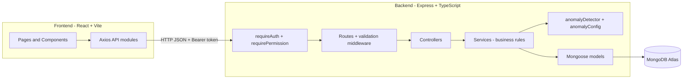

# Dialysis Dashboard
Clinical workflow app for dialysis session intake, tracking, and anomaly highlighting for nurse operations.

## Quick Start (under 5 minutes)
Prerequisites: Node.js 18+, npm, and a MongoDB Atlas connection string.

```bash
git clone <repository-url>
cd dialysis-dashboard

# install dependencies
cd backend && npm install
cd ../frontend && npm install
```

### 1. Configure the backend
Copy `backend/.env.example` to `backend/.env` and fill in three values:

```bash
cd backend
cp .env.example .env

# generate a signing key for auth tokens
node -e "console.log(require('crypto').randomBytes(48).toString('hex'))"
```

| Variable | Required | Notes |
|---|---|---|
| `MONGO_URI` | yes | Atlas connection string |
| `JWT_SECRET` | yes | >= 32 chars. **The server refuses to start without it.** |
| `DEMO_USER_PASSWORD` | yes, to sign in | >= 12 chars. Shared by all seeded demo accounts. |
| `DEMO_USER_EMAIL` | no | Only its domain is used, for the seeded account addresses. |
| `FRONTEND_URL` | in production | Comma-separated CORS allowlist. Required when `NODE_ENV=production`. |

### 2. Seed data and accounts
```bash
npm run seed        # patients and sessions -- DROPS existing ones
npm run seed:user   # one demo login per role -- non-destructive
```

`seed:user` prints the four accounts it created. They all share `DEMO_USER_PASSWORD`:

```
admin   admin@example.com
doctor  doctor@example.com
nurse   nurse@example.com
user    user@example.com
```

### 3. Run
```bash
npm run dev                        # API on :5000   (Terminal 1)
cd ../frontend && npm run dev      # UI  on :5173   (Terminal 2)
```

Open the UI, sign in at `/login`, and the dashboard lives at `/app`. Sign in as
each of the four accounts to see how the interface changes per role.

## Architecture
Frontend pages call Axios API modules, Express routes validate and delegate to controllers, controllers execute session rules and anomaly detection, and Mongoose persists data in MongoDB; this keeps UI concerns, request handling, business rules, and storage concerns separated.


```mermaid
flowchart LR
  subgraph FE[Frontend - React + Vite]
    Pages[Pages and Components]
    ApiClient[Axios API modules]
    Pages --> ApiClient
  end

  subgraph BE[Backend - Express + TypeScript]
    Auth[requireAuth + requirePermission]
    Routes[Routes + validation middleware]
    Controllers[Controllers]
    Services[Services - business rules]
    Detector[anomalyDetector + anomalyConfig]
    Models[Mongoose models]
    Auth --> Routes
    Routes --> Controllers
    Controllers --> Services
    Services --> Detector
    Services --> Models
  end

  DB[(MongoDB Atlas)]

  ApiClient -->|HTTP JSON + Bearer token| Auth
  Models --> DB
```

Key decisions:
- Express over FastAPI: keeps one language (TypeScript) across frontend and backend, reducing context switching and type translation.
- MongoDB Atlas: flexible document model fits evolving session/vitals payloads and supports quick iteration for assignment scope.
- Server-side anomaly detection: guarantees a single source of truth and consistent anomaly flags across all clients.

## Roles & Permissions
Four roles, defined in one place: `backend/src/config/permissions.ts`. Change
`ROLE_PERMISSIONS` there and both the API and the UI follow -- the client never
keeps its own copy of the table, it receives the resolved permission list for the
signed-in user from `GET /api/auth/me`.

| | admin | doctor | nurse | user |
|---|:--:|:--:|:--:|:--:|
| View patients, sessions, machines | + | + | + | + |
| Create and edit patients | + | + | + | |
| Schedule a session | + | + | + | |
| Write nurse notes | + | + | + | |
| Start / complete a session | + | | + | |
| Reorder the queue | + | | + | |

Rationale: a **doctor** owns clinical oversight and the written record, but
operating a machine run and ordering the physical queue is floor work, so those
belong to the **nurse**. **admin** is unrestricted. **user** is a read-only
observer -- useful for a demo, a screen on the wall, or an auditor.

Enforcement is server-side. `requireAuth` rejects anything without a valid bearer
token; `requirePermission('session:start')` then checks the role against the
table, ahead of body validation so a caller who may not perform an action learns
nothing about the payload it would have needed. The UI hides controls the current
role cannot use, but that is a courtesy -- removing the guard in the browser
still gets a 403.

401 and 403 are kept distinct on purpose: the client signs a user out on 401
(the token is dead), and merely shows an error on 403 (the token is fine, the
answer is no).

## Clinical Assumptions & Trade-offs
### Weight Gain
| Metric | Threshold | Clinical rationale |
|---|---|---|
| Excess interdialytic gain | >= 2.0 kg | Early warning threshold for fluid overload risk between sessions |
| Critical interdialytic gain | >= 3.0 kg | Higher-risk threshold indicating potential urgent intervention need |

### Blood Pressure
| Metric | Threshold | Clinical rationale |
|---|---|---|
| High post-dialysis systolic BP | >= 160 mmHg | Conservative post-treatment flag for persistent hypertension risk |

### Session Duration
| Metric | Threshold | Clinical rationale |
|---|---|---|
| Short session | > 30 min below target | May indicate incomplete dialysis delivery |
| Long session | > 60 min above target | May indicate treatment complexity or workflow delays needing review |

- MRN is immutable after creation to preserve patient identity integrity across historical records.
- Machine selection is required before session creation to prevent unassigned treatment records.
- FIFO queue is default for predictability, with manual override to handle urgent clinical prioritization.
- Session workflow is split into start (`not_started` -> `in_progress`) and complete (`in_progress` -> `completed`) to enforce staged validation and avoid partial data corruption.

## Data Modeling Decisions
- Sessions reference patients (rather than embedding) because sessions are unbounded over time and need independent querying, pagination, and updates.
- Anomalies are stored on each session document so historical flags remain reproducible without recalculating from changing configs.
- Indexes added and rationale:
  - `patients.mrn` (unique): enforces patient identity uniqueness.
  - `sessions.scheduledDate + queuePosition`: supports fast daily schedule retrieval and queue ordering.
  - `sessions.patientId + scheduledDay` (unique): enforces one session per patient per day in the
    database rather than in application code, where two concurrent requests can both pass a
    read-then-write check. Its `patientId` prefix also serves history lookups and population.
- `sessions.scheduledDay` is a `YYYY-MM-DD` string derived from `scheduledDate` on every write. A
  unique index cannot express "same calendar day" over a timestamp, so the day is materialized.

## Known Limitations & What's Next
- Roles gate actions, but not rows: every signed-in user sees every patient. There is no
  per-ward or per-caseload scoping.
- No self-service account management. Accounts come from `npm run seed:user`; there is no
  signup, password reset, or admin UI for creating users.
- Sessions do not record who acted on them. `nurseId` exists on the schema but is never
  populated from the authenticated user, so there is no audit trail.
- Tokens are 12-hour and non-refreshable, and are held in `localStorage` (readable by any
  XSS). A shift running past expiry gets bounced to the login screen.
- No real-time push updates; refresh is request-driven.
- Thresholds are global and not patient-personalized.
- Scheduling rules are basic and do not include conflict detection across units.
- A machine is reserved for a whole calendar day, so clinic capacity is capped at one patient per
  machine per day. Real units run several shifts on the same machine; this needs a time-slot model
  rather than a day-level one, which is why machine exclusivity is enforced in the service rather
  than by a unique index.
- Calendar days are computed in the server's local timezone. Deploying the API to a host in a
  different zone than the clinic shifts the "today" boundary.
- No export/audit reporting workflow yet.
- No deployment pipeline or observability dashboard included.

## AI Tools Used
### What for
- Drafting initial API and README structure.
- Generating baseline unit-test skeletons.
- Proposing refactor candidates for session UI components.
- Suggesting validation/error-handling patterns.

### What reviewed manually
- Clinical thresholds and anomaly rule semantics.
- API validation and state-transition guards.
- UI behavior for session cards, badges, and notes flows.
- Seed scenarios for anomaly and non-anomaly coverage.

### One disagreement example
AI suggested one large `VitalsComponent` with conditional rendering for both display and edit states. I split this into focused parts (`VitalsDisplay`, modal/input flows, and `AnomalyBadge`) to reduce prop complexity, improve readability, and simplify testing.

